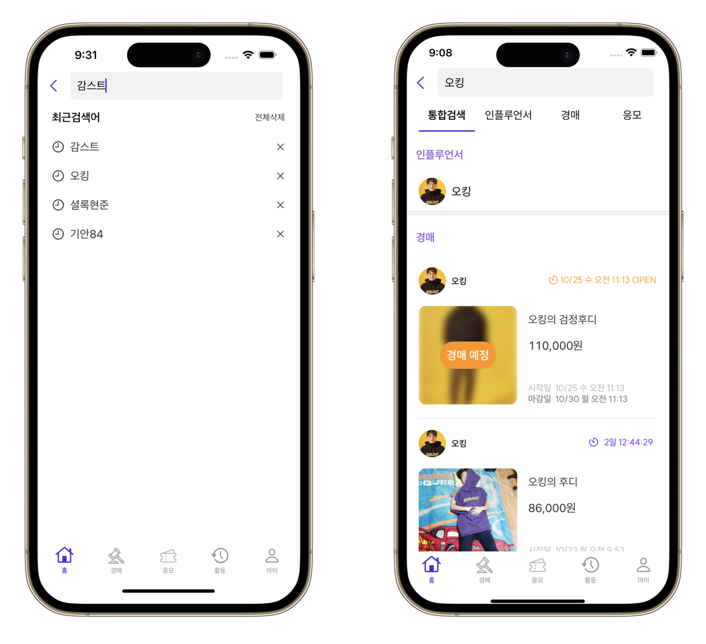
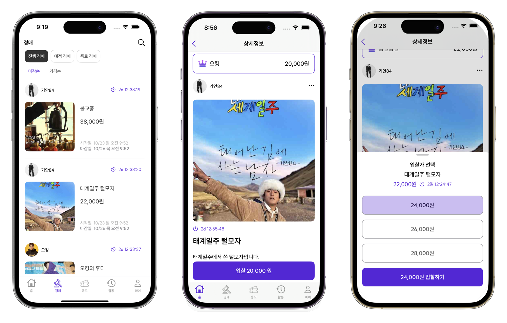
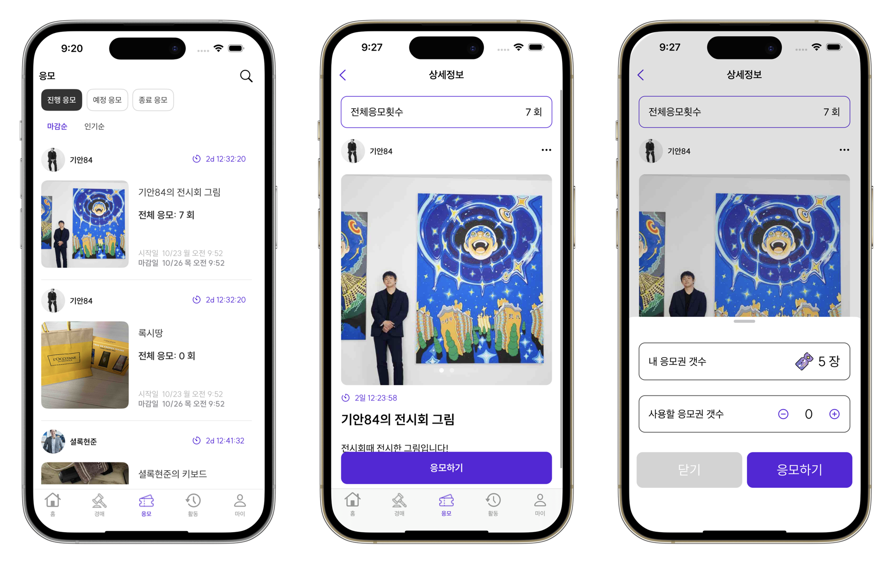
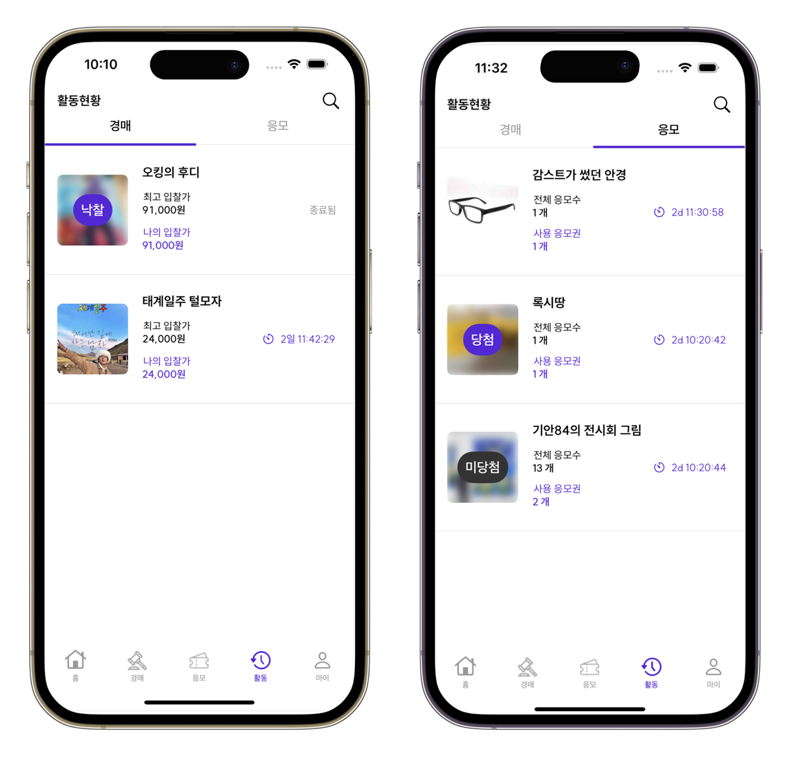
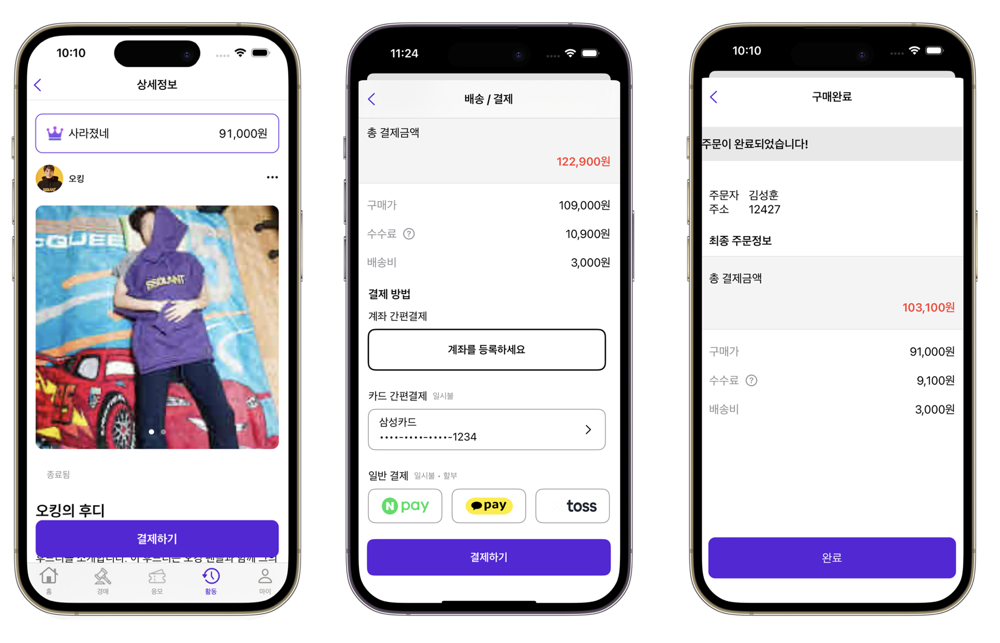
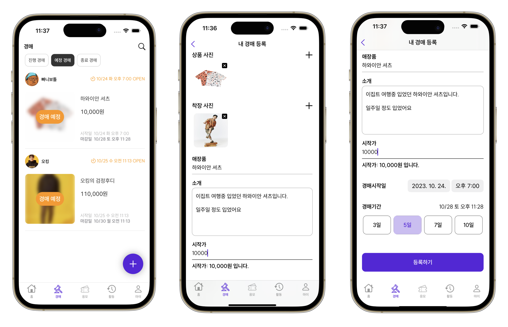
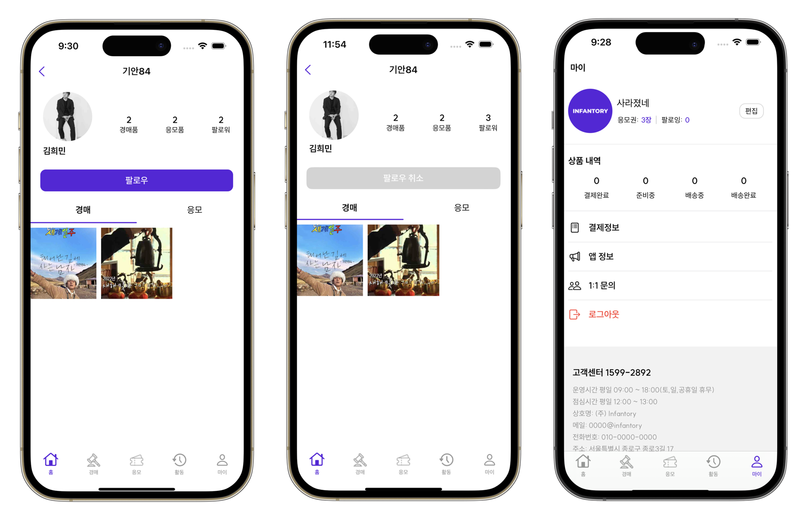
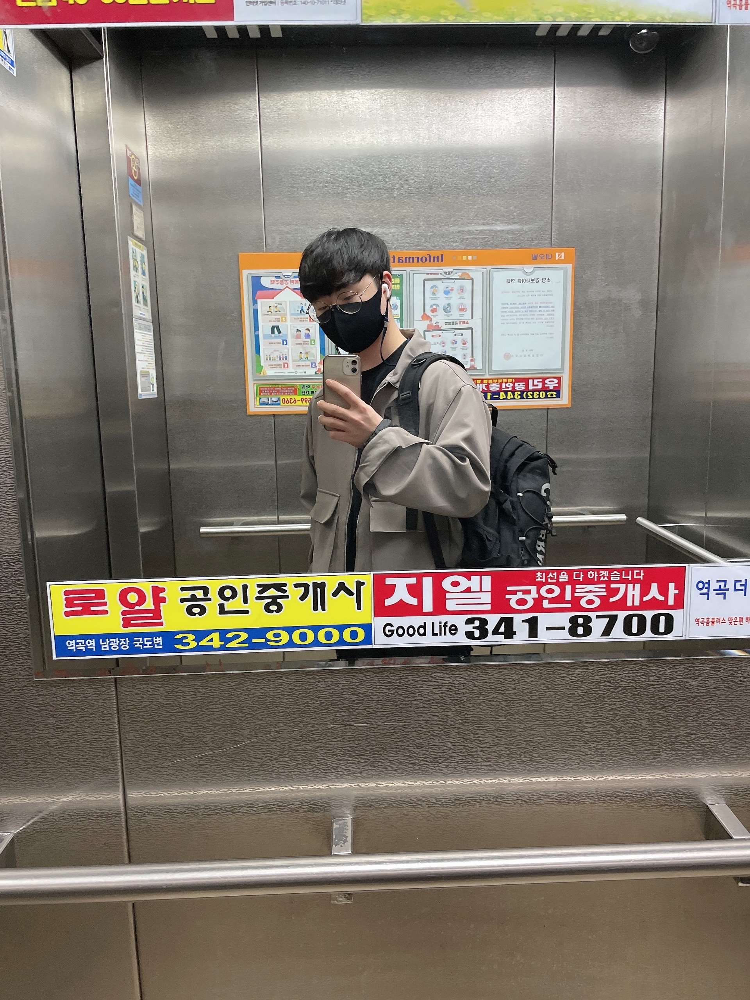

# INFANTORY

## A. 프로젝트 개요

### 1) INFANTORY?

- Influencer, Fan, Inventory의 합성어로 인플루언서의 애장품들을 팬들이 획득하여 저장하는 저장소의 의미

### 2) 개발 동기

-   인플루언서와 크리에이터 시장의 빠른 성장에 따라, 그들과 팬들 간의 상호작용 및 소통을 촉진하는 플랫폼을 제공합니다.
-   기존의 대화형 컨텐츠와 차별화되어, 인플루언서와 크리에이터가 경매나 응모를 통해 자신의 애장품을 팬들에게 제공하게 함으로써, 더욱 흥미로운 방식의 컨텐츠를 제공합니다.

### 3) 사용자에게 제시하는 목표

-   **직관적인 UI/UX**: 경매나 응모 시스템을 간편하고 직관적으로 설계하여 사용자의 접근성을 향상시킵니다.
-   **실시간 경매 경험**: 원활한 네트워크 통신을 통해 실시간으로 경매 상황을 업데이트하여 사용자에게 즉각적인 경매 경험을 제공합니다.

### 4) 앱의 구현을 위한 기술적 목표

-   비회원 활동 지원
-   간편한 회원가입 프로세스
-   직관적인 UI/UX 디자인
-   유저 권한 부여 시스템
-   효율적인 검색 기능
-   커뮤니티 기능 구현

### 5) 페르소나

**상필 (25세, 대학생)**:

-   패션과 뷰티에 관심이 많으며, 주로 패션 인플루언서의 소셜미디어 콘텐츠를 즐겨봅니다.
-   인플루언서의 상품에 관심이 많고, 더 많은 소통을 원합니다.
-   앱을 통해 패션 인플루언서의 애장품을 응모하고 경매에 참여하며, 소장가치를 느끼고 싶어합니다.

**지영 (29세, 뷰티 및 패션 인플루언서)**:

-   뷰티와 패션 분야에서 활발하게 활동하는 블로거로, 큰 팬덤을 가지고 있습니다.
-   팬들과 더 가까운 소통을 원하며, 앱을 통해 자신의 애장품을 경매하고 응모할 수 있는 기회를 제공하고자 합니다.
-   이를 통해 팬덤을 확장하고 수익을 창출하며, 자신의 브랜드를 확장하려 합니다.

### 6) 아키텍처 및 개발 도구

**MVVM Model**:

-   ViewModel: 비즈니스 로직 처리
-   View: 사용자 인터페이스
-   Actions: 사용자의 액션 처리
-   UI State: UI 상태 관리
-   Update: 상태 업데이트
-   Notify: 상태 변화 알림

**개발언어**:

-   SwiftUI

**개발환경**:

-   Xcode 13.4

**협업도구**:

-   Git
-   Notion
-   Figma

# B. 프로젝트 소개

<table>
  <tr>
    <td></td>
    <td>
      <strong>응모 추첨 발표</strong> 
      당첨자가 발표되는 순간을 놓치지 마세요! 응모한 모든 이벤트의 결과를 실시간으로 확인할 수 있습니다.  
      <strong>인플루언서 추천</strong> 
      당신의 취향에 맞는 인플루언서를 추천받으세요. 더 많은 상호작용을 통해 좋아하는 인플루언서와 가까워지세요.  
      <strong>인기있는 애장품 경매 리스트</strong> 
      현재 가장 인기있는 애장품 경매 목록을 확인하세요. 놓치지 않고 참여하여 희귀한 아이템을 손에 넣을 기회를 잡으세요.   
      <strong>마감 전 응모 리스트</strong> 
      시간이 얼마 남지 않은 응모 이벤트를 한눈에 확인하세요. 마감 전에 참여하여 행운을 잡으세요.  
    </td>
  </tr>
</table>

<table>
  <tr>
    <td></td>
    <td>
      <strong>최근 검색어</strong> 
      최근에 검색했던 내용을 쉽게 다시 찾을 수 있습니다.  
      <strong>통합 검색</strong> 
      모든 카테고리를 통틀어 원하는 내용을 빠르게 찾을 수 있습니다.  
      <strong>탭별 검색 기능</strong> 
      인플루언서, 경매, 응모 등의 카테고리별로 구분하여 검색할 수 있습니다. 원하는 정보를 더 정확하고 빠르게 찾아보세요.  
    </td>
  </tr>
</table>

<table>
  <tr>
    <td></td>
    <td>
      <strong>애장품 경매 목록</strong> 
      다양한 인플루언서들의 애장품들이 경매에 올라와 있습니다. 원하는 애장품을 찾아보세요.  
      <strong>실시간 입찰 현황</strong> 
      각 애장품 경매의 입찰 현황을 실시간으로 확인할 수 있습니다. 경매의 흥미진진한 순간을 놓치지 마세요.  
      <strong>경매 필터</strong> 
      다양한 필터 옵션을 사용하여 원하는 애장품을 빠르게 찾을 수 있습니다. 카테고리, 가격 범위, 인플루언서 이름 등으로 필터링 해보세요.  
      <strong>입찰 기능</strong> 
      원하는 애장품에 직접 입찰할 수 있는 기능입니다. 경쟁을 통해 희귀한 애장품을 손에 넣으세요.  
    </td>
  </tr>
</table>

<table>
  <tr>
    <td></td>
    <td>
      <strong>애장품 응모 목록</strong> 
      다양한 인플루언서들이 제공하는 특별한 애장품들을 응모할 수 있는 목록입니다. 마음에 드는 아이템을 찾아보세요.  
      <strong>응모 필터</strong> 
      원하는 애장품을 빠르게 찾을 수 있도록 다양한 필터 옵션을 제공합니다. 카테고리, 인플루언서 이름, 응모 마감일 등으로 필터링 해보세요.  
      <strong>응모 기능</strong> 
      원하는 애장품에 직접 응모할 수 있는 기능입니다. 행운을 시험해보세요!  
    </td>
  </tr>
</table>

<table>
  <tr>
    <td></td>
    <td>
      <strong>내 경매/응모 활동 목록</strong> 
      참여한 경매와 응모 이벤트의 목록을 한 눈에 확인할 수 있습니다. 자신의 활동을 쉽게 추적하고 관리하세요.  
      <strong>경매 낙찰, 응모 당첨 결과 표시</strong> 
      경매에서 낙찰을 받았거나 응모 이벤트에서 당첨되었을 때의 결과를 실시간으로 확인할 수 있습니다. 당신의 행운을 놓치지 마세요!  
    </td>
  </tr>
</table>

<table>
  <tr>
    <td></td>
     <td>
      <strong>계좌 등록, 간편 결제</strong> 
      계좌를 등록하고 간편 결제 기능을 사용하여 빠르고 쉽게 경매에 참여하거나 응모할 수 있습니다.  
      <strong>주소 입력</strong> 
      상품 배송을 위해 주소를 입력하고 관리할 수 있습니다. 배송 정보를 정확하게 입력하여 원활한 상품 수령을 도와주세요.  
    </td>
  </tr>
</table>

<table>
  <tr>
    <td></td>
       <td>
      <strong>인플루언서 등록 플로팅 버튼</strong> 
      인플루언서로서 활동하기 위해 자신을 등록할 수 있는 플로팅 버튼이 제공됩니다. 간단한 클릭으로 등록 절차를 시작하세요.  
      <strong>응모/경매 등록</strong> 
      인플루언서로 등록한 후에는 자신의 애장품을 경매에 올리거나 응모 이벤트를 개최할 수 있습니다. 팬들과의 상호작용을 늘리고 수익을 창출하세요.  
    </td>
  </tr>
</table>

<table>
  <tr>
    <td></td>
    <td>
      <strong>인플루언서 팔로우 기능</strong> 
      좋아하는 인플루언서를 팔로우하여 그들의 최신 활동을 빠르게 받아볼 수 있습니다. 팔로우하여 커뮤니티에 참여하세요.  
      <strong>해당 인플루언서 경매/응모 물품 피드 목록</strong> 
      팔로우한 인플루언서의 경매 및 응모 물품들을 한 눈에 볼 수 있는 피드 목록입니다. 놓치지 않고 참여하세요.  
    </td>
  </tr>
</table>

## 3-1) 앱의 기술적 특이점

-   **실시간 경매 데이터 반영**: Firestore만을 사용할 때는 실시간으로 유저들의 데이터를 반영하기 어려운 문제가 있었습니다. 하지만 Firebase Realtime Database를 사용함으로써, 경매에 참여하는 유저들에게 실시간으로 변동되는 경매 상황과 입찰 현황을 보여줄 수 있게 되었습니다.

## 3-2) 앱의 기술적 특이점

-   **이미지 로딩 최적화**: 앱 내에서 이미지를 로딩할 때 URL을 통한 네트워킹을 하게 됩니다. Firebase Storage를 사용할 경우 트래픽량이 과도하게 증가하는 문제가 발생할 수 있습니다. 이를 해결하기 위해 이미지를 메모리 캐시에 저장하고, 한 번 다운로드 받은 URL에 대해서는 다시 다운로드 받지 않도록 하였습니다. 이로써 트래픽량을 줄이고 이미지 로딩 속도를 향상시켰습니다.

## 3-3) 앱의 기술적 특이점

-   **실시간 타이머로 남은 시간 표시**: 경매 및 응모 기능에서 마감일만 표시되었던 것을 개선하여, 사용자에게 남은 시간을 실시간 타이머로 보여줌으로써 더 직관적인 UX를 제공하게 되었습니다.

## 4) 결과

-   **비회원 활동 지원**: 로그인 없이도 앱의 기본 기능들을 둘러볼 수 있도록 하였습니다.
-   **간편한 회원가입**: 카카오API를 이용하여 사용자가 빠르고 간편하게 회원가입을 할 수 있도록 하였습니다.
-   **실시간 경매 기능**: Firebase Realtime Database를 사용하여 실시간 경매 기능을 구현하였습니다.
-   **특정 유저 권한 부여**: 인플루언서에게만 경매와 응모 업로드가 가능하도록 권한을 부여하였습니다.
-   **검색 기능**: 사용자가 원하는 인플루언서나 애장품을 검색을 통해 찾을 수 있도록 하였습니다.

# C. 프로젝트 발전방향

## 1) 기대효과

### 다양한 콘텐츠 접근성

-   더 많은 인플루언서와 다양한 콘텐츠에 접근할 수 있는 기회를 제공합니다.

### 맞춤형 경험 강화

-   유저는 더 많은 인플루언서 및 다른 팬과 상호 작용하고, 맞춤형 경험을 누릴 수 있습니다.

### 팬 베이스 확장

-   인플루언서는 더 많은 팬을 유치하고 더 넓은 영향을 행사할 수 있는 기회를 제공받습니다.

### 수익 증대

-   인플루언서는 애장품 경매 및 응모를 통해 더 큰 팬층을 확보하여 수익을 늘릴 수 있습니다.

### 수익 모델 강화

-   플랫폼은 더 많은 유저 및 인플루언서를 확보하고, 애장품 판매를 통해 수익모델 확보 가능합니다.

#### 팬 기대효과

-   인플루언서와 더 가깝게 소통하고, 그들의 애장품을 소유할 수 있는 기회를 얻습니다.

#### 인플루언서 기대효과

-   팬 베이스를 확장하고, 애장품 판매를 통해 수익을 창출할 수 있습니다.

#### 플랫폼 기대효과

-   더 많은 유저와 인플루언서를 유치하여 플랫폼의 성장을 촉진할 수 있습니다.

## 2) 향후 방향과 계획

### 커뮤니티성 확장

-   앱 내 커뮤니티 기능을 개발하여 경매, 응모에 참여하는 유저들 간의 소통 및 인플루언서와의 상호작용을 증대합니다.

### 개인화된 경험 제공

-   상품이 늘어남에 따라 유저의 기호나 선호도를 분석하여 맞춤형 상품을 표시하여 개인화된 앱 경험을 제공합니다.

### 플랫폼 확장

-   애장품 경매, 응모에서 확장하여 다양한 이벤트를 제공하거나, 라이브 스트리밍 등의 추가 활동을 제공합니다.

## 3) 개발하면서 얻은 교훈

-   프로젝트를 시작할 때 기획, 디자인, 개발 기초 설계가 중요합니다.
-   개발을 시작하기 전 협업에 있어서 정하고 가면 좋은 것들이 많다는 것을 깨달았습니다.
-   앱을 개발하기 전 사용자 니즈, 경험 등 철저한 사전 준비를 하여 사용자 중심의 개발의 중요성을 느꼈습니다.
-   앱의 느린 로딩, 응답성 문제 해결을 위해 초기 데이터 모델링 및 앱 최적화의 중요성을 느꼈습니다.
-   새로운 기능을 추가할 때 적절한 예외처리를 해서 앱 사용 품질을 높여야 한다는 것을 깨달았습니다.

## 4) 팀원소개 (R&R)

### 팀원 소개

|[ 김성훈 ]    "" | [ 변상필 ]    "" | [ 봉주헌 ]    "개발 쉽네 ㅋㄷ 라고할뻔" | [ 안지영 ]   ""  |
| :----------------------------------------------------------: | :---------------------------------------------: | :------: | :-------------------------------------------------: |
| |  |   |  |

|[ 윤경환 ]    "" | [ 이희찬 ]    "" | [ 전민석 ]    "" | [ 조민근 ]   ""  |
|:-----------------------------------------------------------: | :---------------------------------------------: | :------: | :--------------------------------------------------: | 
| |  |   |  |

 

### 김성훈 (PM)

-   프로젝트 관리

### 변상필 (PO, 결제, 활동, 경매, 관리자)

-   결제, 경매 기능 구현

### 봉주헌 (마이, 등록)

-   마이페이지, 경매/응모 등록 구현

### 안지영 (로그인, 홈, 응모, 검색)

-   로그인, 응모 , 검색 기능 구현

### 윤경환 (마이, 등록)

-   마이페이지, 경매/응모 등록 구현

### 이희찬 (결제, 활동, 경매)

-   경매, 결제, 활동내역 기능 구현

### 전민석 (결제, 활동, 경매)

-   경매, 결제, 활동내역 기능 구현

### 조민근 (로그인, 홈, 응모, 검색, 관리자)

-   로그인, 응모, 검색, 관리자앱 구현
